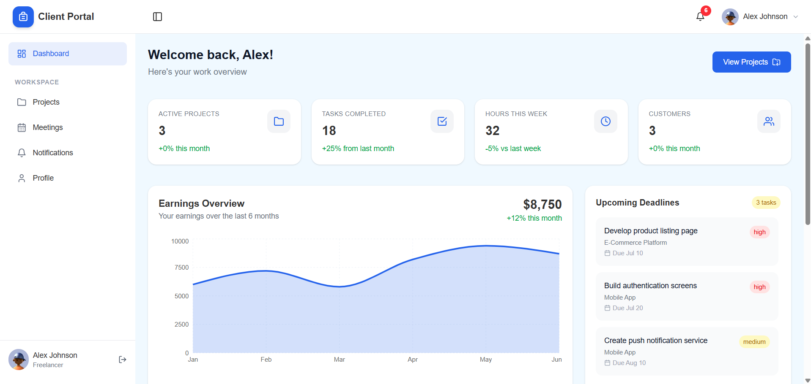
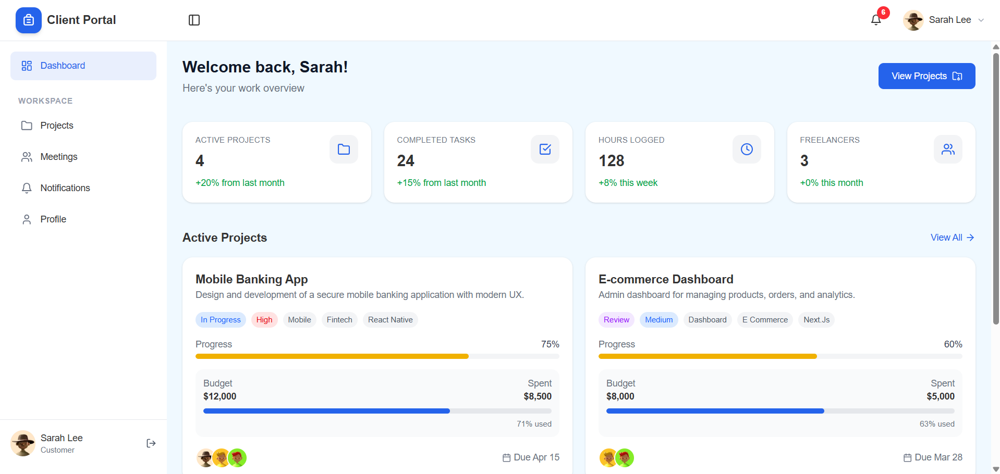
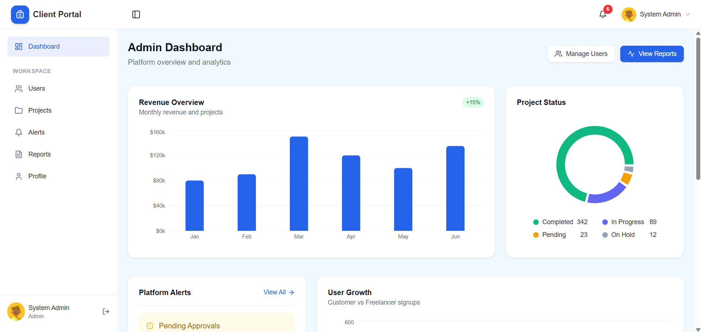
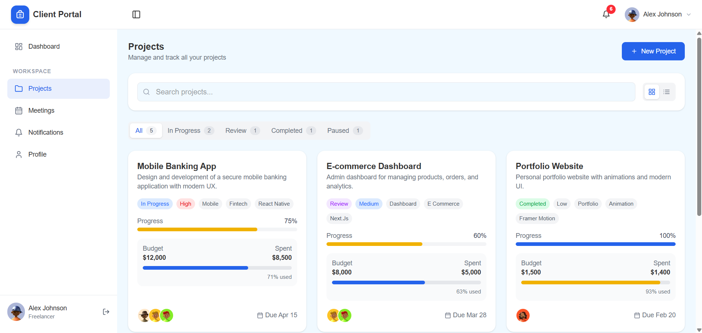
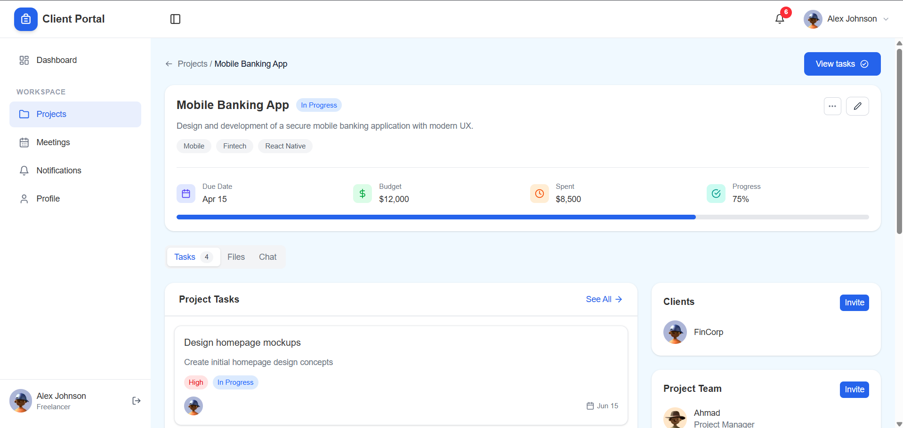
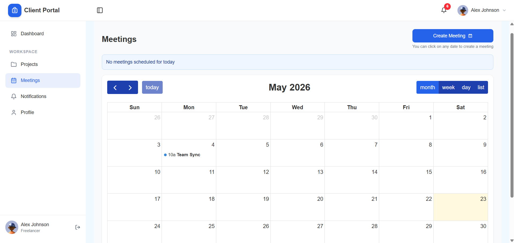
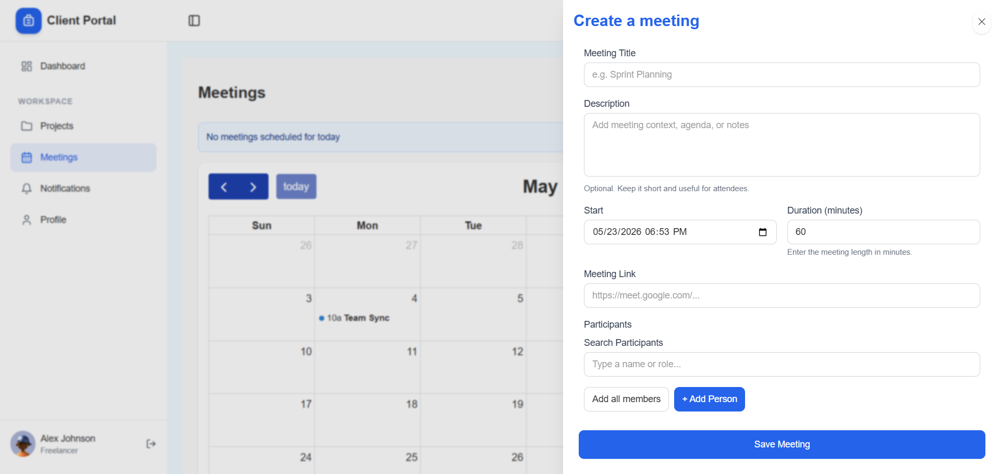
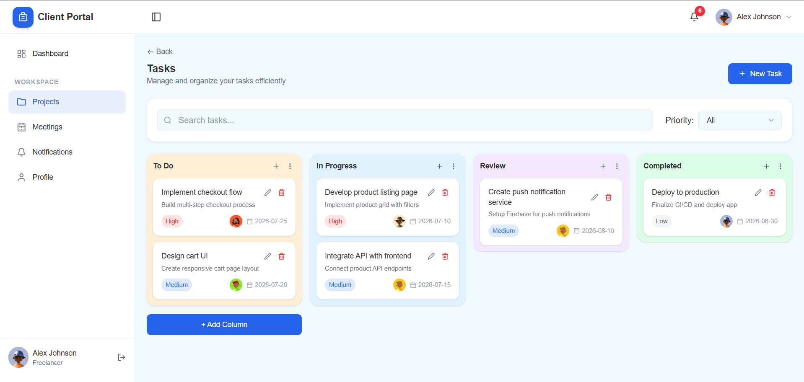
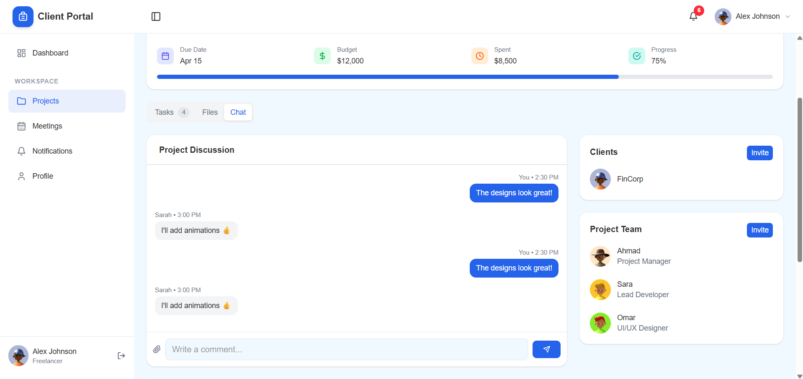

<div align="center">

# Client Portal

[](https://nextjs.org/)
[](https://www.typescriptlang.org/)
[](https://react.dev/)
[](https://tailwindcss.com/)
[]()
[](./LICENSE)

<br />

A modern, responsive dashboard UI built for freelancers, clients, and admins —  
focused on clean architecture, reusable components, and polished UX.

<br />

| Freelancer                             | Client                         | Admin                        |
| -------------------------------------- | ------------------------------ | ---------------------------- |
|  |  |  |

</div>

---

## About

Client Portal is a frontend-only dashboard application built to simulate a real-world SaaS project management experience. It features role-based interfaces, clean UI patterns, and a scalable component structure - all using mock data and simulated authentication.

The focus of this project is intentionally on the frontend: component design, layout architecture, responsive behavior, and UI/UX quality - not backend logic.

---

## Screenshots

| Projects                           | Projects Details                          |
| ---------------------------------- | ----------------------------------------- |
|  |  |

| Meetings                           | Meeting Creation                           |
| ---------------------------------- | ------------------------------------------ |
|  |  |

| Tasks                        | Chat                        |
| ---------------------------- | --------------------------- |
|  |  |

---

## Features

- **Role-Based Dashboards** - Separate views and layouts for `Freelancer`, `Client`, and `Admin` roles
- **Project Management UI** - Project cards, status indicators, and detail views
- **Task Tracking Interface** - Task lists with priority, status, and assignment UI
- **File Management** - Upload zones, file lists, and download UI
- **Analytics Widgets** - Summary cards and activity overviews
- **Meetings Calendar** - Full calendar view (month / week / day / list) with meeting scheduling
- **Project Discussion (Chat)** - Per-project threaded messaging between team and clients
- **Auth Pages** - Login and registration UI with simulated authentication
- **Loading States** - Skeleton screens across all data-heavy views
- **Fully Responsive** - Optimized for mobile, tablet, and desktop
- **Reusable Components** - Shared UI primitives used consistently across the app
- **Scalable Folder Structure** - Feature-based organization built to grow

---

## Tech Stack

| Technology                                                                | Use                                         |
| ------------------------------------------------------------------------- | ------------------------------------------- |
| [Next.js 16](https://nextjs.org/)                                         | Routing, SSR, and project structure         |
| [TypeScript](https://www.typescriptlang.org/)                             | Static typing across the codebase           |
| [React 19](https://react.dev/)                                            | Component-based UI rendering                |
| [Tailwind CSS v4](https://tailwindcss.com/)                               | Utility-first styling and layout            |
| [Framer Motion](https://www.framer.com/motion/)                           | Page transitions and micro-interactions     |
| [React Icons](https://react-icons.github.io/react-icons/)                 | Consistent icon set across the UI           |
| [React Hook Form](https://react-hook-form.com/) + [Zod](https://zod.dev/) | Form state management and schema validation |
| [TanStack Query](https://tanstack.com/query)                              | Data fetching, caching, and sync            |
| [dnd kit](https://dndkit.com/)                                            | Draggable task and list interactions        |
| [FullCalendar](https://fullcalendar.io/)                                  | Meeting scheduling and calendar views       |
| [Recharts](https://recharts.org/)                                         | Analytics widgets and earnings overview     |
| [React Hot Toast](https://react-hot-toast.com/)                           | In-app success and error toasts             |

---

## Folder Structure

```
client-portal/
├── assets/                         # README screenshots
├── src/
│   ├── app/
│   │   ├── (protected)/            # Auth-guarded routes
│   │   ├── (public)/               # Public routes (login, register)
│   │   ├── globals.css
│   │   ├── layout.tsx              # Root layout
│   │   └── page.tsx                # Entry point / redirect
│   │
│   ├── features/                   # Feature-based modules
│   │   ├── adminPages/
│   │   ├── auth/
│   │   ├── dashboard/
│   │   ├── home/
│   │   ├── layout/
│   │   ├── meetings/
│   │   ├── notifications/
│   │   ├── profile/
│   │   ├── projects/
│   │   └── tasks/
│   │       ├── components/         # Feature UI components
│   │       ├── hooks/              # Feature-specific hooks
│   │       ├── mappers/            # Data transformation logic
│   │       ├── mocks/              # Mock/demo data
│   │       ├── schemas/            # Validation schemas
│   │       ├── services/           # API or data service calls
│   │       ├── types/              # Feature-scoped TypeScript types
│   │       └── utils/              # Feature utilities
│   │
│   └── shared/                     # Cross-feature shared code
│       ├── animation/              # Shared animation utilities
│       ├── components/             # Reusable UI primitives
│       ├── hooks/                  # Global custom hooks
│       └── utils/                  # Global utility functions
│
├── public/                         # Static assets served by Next.js
├── next.config.ts
├── tailwind.config.js
└── tsconfig.json
```

---

## Getting Started

**Prerequisites:** Node.js `v18+` and npm / yarn / pnpm

**1. Clone the repo**

```bash
git clone https://github.com/your-username/client-portal.git
cd client-portal
```

**2. Install dependencies**

```bash
pnpm install
```

**3. Start the dev server**

```bash
pnpm run dev
```

Visit [http://localhost:3000](http://localhost:3000) — no environment setup required.

> The app runs entirely on mock data. No backend, database, or API keys needed.

---

## Available Scripts

| Command               | Description                |
| --------------------- | -------------------------- |
| `pnpm run dev`        | Start development server   |
| `pnpm run build`      | Build for production       |
| `pnpm run start`      | Run production build       |
| `pnpm run lint`       | Lint with ESLint           |
| `pnpm run type-check` | TypeScript check (no emit) |

---

## Demo Roles

Use the following to explore each role's dashboard:

| Role       | Email              | Password    |
| ---------- | ------------------ | ----------- |
| Admin      | admin@portal.com   | password123 |
| Freelancer | alex@freelance.com | password123 |
| Client     | sarah@company.com  | password123 |

---

## Contributing

Feedback and contributions are welcome.

1. Fork the repo
2. Create a branch: `git checkout -b feature/your-feature`
3. Commit your changes: `git commit -m "feat: your feature"`
4. Push and open a pull request

---

## License

Licensed under the [MIT License](./LICENSE).

---

<div align="center">
  <sub>Frontend portfolio project · Built with Next.js and Tailwind CSS</sub>
</div>
